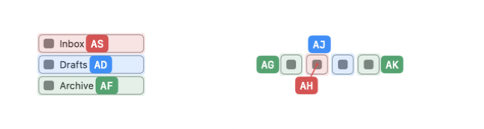
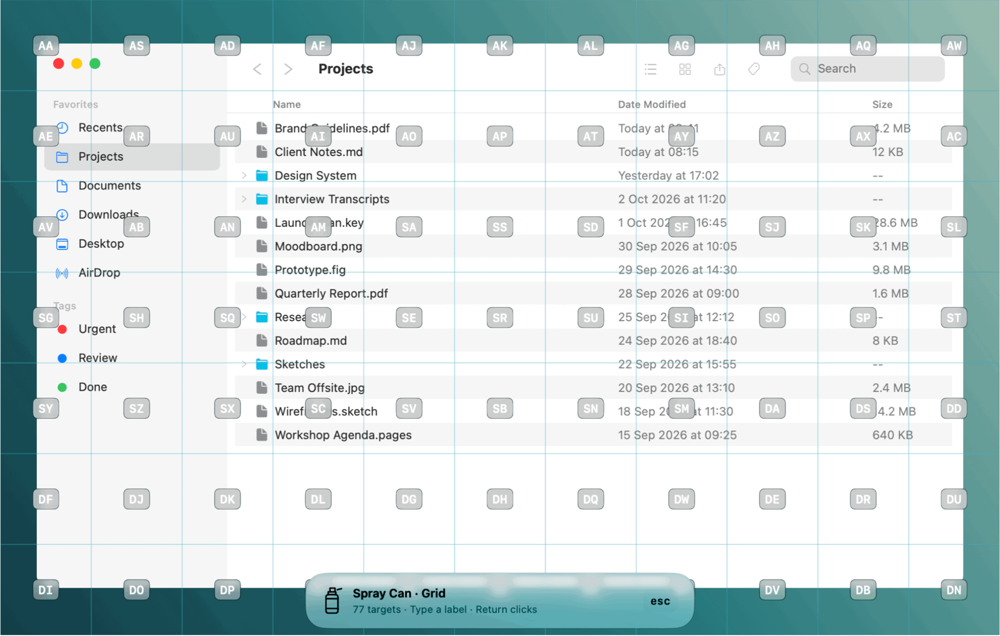
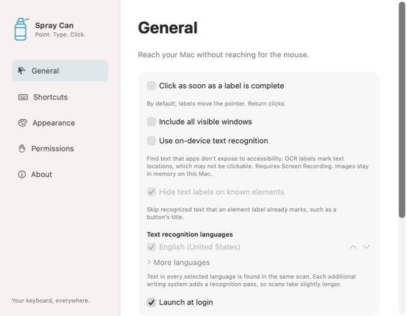

<p align="center">
  
</p>

<h1 align="center">Spray Can</h1>

<p align="center">
  <strong>Navegación con el teclado que ve lo que la Accesibilidad pasa por alto.</strong><br>
  Navega por tu Mac con etiquetas, cuadrículas y OCR privado en el dispositivo.
</p>

<p align="center">
  macOS 14+ · Apple Silicon e Intel · Swift + AppKit · Procesamiento 100 % local
</p>

<p align="center">
  🌐 <a href="README.md">English</a> · <a href="README.zh-Hans.md">简体中文</a> · <a href="README.zh-Hant.md">繁體中文</a> · <a href="README.ja.md">日本語</a> · <a href="README.ko.md">한국어</a> · <strong>Español</strong>
</p>

<p align="center">
  <em>Esta es una traducción; si difiere del README en inglés, prevalece la versión en inglés.</em>
</p>

<p align="center">
  <a href="https://buymeacoffee.com/ziyang">
    <br>
    Apoya Spray Can
  </a>
</p>

**Gratuito y de código abierto bajo la [MIT License](LICENSE).**
Sin suscripciones, niveles de pago, analíticas ni OCR en la nube.


Spray Can te permite **hacer clic, arrastrar, desplazarte y navegar sin tocar el ratón**.

Pulsa **⇧⌘J**, escribe una etiqueta y pulsa **Return**.

A diferencia de las herramientas que dependen solo de la Accesibilidad de macOS, Spray Can también puede usar **el OCR de Apple Vision íntegramente en el dispositivo** para etiquetar texto visible que una app no expone a través de su árbol de accesibilidad.

Las capturas de pantalla nunca salen de tu Mac.

## Ve más. Llega a todo.

Spray Can combina tres capas de selección de objetivos:

- **Accesibilidad**: controles precisos, botones, campos, filas, menús e interfaz del sistema.
- **OCR en el dispositivo**: reconoce texto visible cuando la Accesibilidad no lo expone.
- **Cuadrícula**: llega a todo lo demás, incluidos lienzos personalizados y áreas sin etiquetar.

El OCR usa **ScreenCaptureKit + Apple Vision** y se ejecuta localmente. Los fotogramas capturados se procesan en memoria y se descartan: sin inferencia en la nube, registros de capturas ni analíticas.


## Cuatro formas de navegar

| Modo | Atajo | Para qué sirve |
| --- | --- | --- |
| **Elementos** | ⇧⌘J | Controles accesibles + texto OCR |
| **Cuadrícula** | ⇧⌘K | Cualquier posición en cualquier pantalla conectada |
| **Libre** | ⇧⌘L | Movimiento preciso del puntero con el teclado |
| **Desplazar** | ⌃J | Desplazamiento HJKL al estilo Vim |

Los atajos globales son totalmente configurables.

## Diseñado para no estorbar

Spray Can mantiene el foco en la app de destino mientras navegas.

La entrada del teclado se captura de forma independiente de la superposición, así que puedes empezar a escribir de inmediato mientras la detección de elementos y el OCR continúan en segundo plano. Los resultados tardíos del OCR no pueden cambiar las etiquetas una vez que empiezas a escribir.

Antes de hacer clic, los objetivos accesibles se vuelven a validar para reducir errores por objetivos obsoletos.

Las etiquetas siguen a tu foco. Cuando cambia la ventana de destino —al cambiar de pestaña, abrir una ventana, moverla o redimensionarla, o pasar a otra app con ⌘Tab o un clic—, Spray Can vuelve a buscar y muestra etiquetas nuevas. Una etiqueta escrita a medias se borra, y un arrastre en curso se cancela en lugar de soltarse en un lugar inesperado. Los modos Cuadrícula y Libre cubren pantallas enteras, así que no se ven afectados.

## Etiquetas claras, incluso en interfaces densas

Las etiquetas se colocan **justo al lado** de su elemento —normalmente justo después de su texto— y nunca tapan el texto ni el icono en el que vas a hacer clic. Cada elemento tiene una sola etiqueta, y solo aparece una línea de conexión en el raro caso de que una etiqueta no pueda tocar su elemento. Elige izquierda, derecha, arriba, abajo o sobre el elemento en **Apariencia**, y ajusta la posición con desplazamientos horizontales y verticales.

**Colorear etiquetas** da colores claramente distintos a las etiquetas cercanas y sombrea cada elemento con el color de su etiqueta, para que cada etiqueta y su elemento se emparejen de un vistazo. Muestra el sombreado siempre, solo al escribir o nunca, y ajusta su opacidad. Al escribir una letra, solo quedan los elementos que coinciden, resaltados con su color.




## Arrastra, haz clic, desplázate

Spray Can admite:

- clic izquierdo, central, derecho y doble clic
- clic con modificadores
- arrastrar y soltar
- movimiento del puntero fino y por celdas completas
- saltos a los bordes de la pantalla
- desplazamiento al estilo Vim
- varias pantallas

Ejemplo de arrastre:

`⇧⌘K` → escribe la etiqueta de origen → `Espacio` → escribe la etiqueta de destino → `Espacio`

El botón pulsado se desliza hasta cada destino, así que las apps que siguen el puntero —incluida la herramienta de capturas de macOS (⇧⌘4)— siguen el arrastre.



## Experiencia nativa de macOS



Spray Can está creado con Swift y AppKit.

Usa **Liquid Glass en macOS 26+**, materiales nativos en macOS 14–15, y respeta «Reducir transparencia». Desactiva **Usar Liquid Glass** en Apariencia para tener fondos lisos en las etiquetas y el panel de estado. Con el cristal desactivado, la opacidad del fondo de las etiquetas es ajustable sin atenuar el texto. El regulador está desactivado mientras el cristal o «Reducir transparencia» estén activados.

Puedes personalizar:

- los atajos de navegación
- el alcance de los objetivos
- el OCR y sus idiomas de reconocimiento
- las teclas de vi
- la posición y los desplazamientos de las etiquetas
- los colores de etiquetas, el sombreado de elementos y su opacidad
- el tamaño de las etiquetas
- el espaciado de la cuadrícula
- la opacidad del fondo
- los colores de etiquetas, OCR, cuadrícula, texto y selección
- el idioma de la interfaz

La interfaz de Spray Can está disponible en English, 简体中文, 繁體中文, 日本語, 한국어 y Español. De forma predeterminada sigue el idioma de tu Mac; elige otro en **General → Idioma** y reinicia Spray Can cuando se te pida.


## Instalación

Instálalo desde [mi tap de Homebrew](https://github.com/Kymer0615/homebrew-tap):

```sh
brew install --cask kymer0615/tap/spray-can
open "/Applications/Spray Can.app"
```

Para actualizar o desinstalar:

```sh
brew update
brew upgrade --cask kymer0615/tap/spray-can
brew uninstall --cask spray-can
```

La desinstalación normal conserva las preferencias. Si lo instalaste manualmente, cierra Spray Can y saca esa copia de Aplicaciones antes de cambiar a Homebrew para no ejecutar dos copias.

También puedes descargar el ZIP universal desde [Releases](https://github.com/Kymer0615/spray_can/releases), descomprimirlo y mover **Spray Can.app** a Aplicaciones.

La versión 0.1.2 tiene **firma ad hoc y no está notarizada**. Si macOS bloquea una compilación en la que confías:

**Ajustes del Sistema → Privacidad y seguridad → Abrir igualmente**

Spray Can puede solicitar:

1. **Accesibilidad**: detectar controles, capturar las teclas de navegación y realizar acciones con el puntero.
2. **Grabación de pantalla**: opcional, solo se usa para el OCR en el dispositivo.

La captura de teclado usa el acceso de Accesibilidad; no requiere configurar aparte la Monitorización de entrada. La página Permisos indica si la captura está realmente en funcionamiento.

Los archivos de cada versión y sus sumas de comprobación SHA-256 están versionados. Consulta las [instrucciones de publicación](docs/RELEASING.md).

## Privacidad

Spray Can está diseñado para funcionar localmente.

- el OCR se ejecuta mediante **Apple Vision en el dispositivo**
- las capturas se procesan en memoria y se descartan
- sin registros de capturas
- sin analíticas
- sin inferencia en la nube
- no requiere cuenta ni suscripción

## Idiomas del OCR

El OCR puede leer **varios idiomas a la vez**. En **General → Idiomas de reconocimiento de texto**, selecciona los idiomas que Apple Vision admita en tu Mac y ordénalos. El texto de todos los idiomas seleccionados se etiqueta en el mismo análisis, así que puedes llegar a la vez a una barra de herramientas en inglés, un documento en chino y un menú en japonés.

Los idiomas que comparten sistema de escritura, como el inglés, el francés y el español, se reconocen juntos. Cada sistema de escritura adicional, como el chino, el japonés o el coreano, añade una pasada de reconocimiento sobre la misma captura, así que el análisis tarda un poco más. De forma predeterminada, Spray Can selecciona los idiomas preferidos de tu Mac más el inglés.

## Limitaciones del OCR

El OCR reconoce **la ubicación del texto**, no si ese texto es clicable.

Por tanto, una etiqueta reconocida puede apuntar a un encabezado u otro texto no interactivo. Tampoco detecta todos los iconos sin etiqueta ni cualquier control visual arbitrario.

Para esos casos, usa el **modo Cuadrícula**.

Consulta [VALIDATION.md](docs/VALIDATION.md) para ver el estado actual de compatibilidad y pruebas.

## Compilación

Requiere **Xcode 26+**.

```sh
scripts/test.sh
scripts/build.sh
scripts/install-local.sh
```

Para desarrollo:

```sh
swift scripts/generate-artwork.swift
python3 scripts/generate-project.py
scripts/render-docs.sh
scripts/integration-test.sh
swift scripts/ocr-smoke.swift
swift scripts/ocr-smoke.swift image.png --languages en-US,zh-Hans,ja-JP --expect "Open,打开,開く"
python3 scripts/check-localizations.py
scripts/release.sh 0.1.2 adhoc
```

Abre `SprayCan.xcodeproj` en Xcode.

Las traducciones de la interfaz están en `Resources/<language>.lproj/Localizable.strings`; las claves en inglés son el texto de origen. `scripts/check-localizations.py` comprueba que cada idioma tenga todas las claves y los mismos marcadores de posición.

`SprayCanCore` contiene la máquina de estados de la sesión, la generación y colocación de etiquetas, la agrupación de idiomas del OCR, las reglas de actualización, la geometría y las asignaciones de atajos. `Sources/SprayCanApp` contiene la interfaz de la app, la captura de eventos, los proveedores de detección, el controlador del ratón y las superposiciones.

## Estado

Spray Can 0.1.2 está disponible para macOS 14 y posteriores.

El núcleo de navegación se ha sometido a pruebas de estrés con **1000 ciclos rápidos de activación**, y un entorno de pruebas nativo completó **60 ciclos de clic con elementos y cuadrícula** sin clics fallidos ni fugas de entrada.

La compatibilidad con apps de terceros, varias pantallas, pantalla completa y distintas versiones aún se está validando.

Consulta [VALIDATION.md](docs/VALIDATION.md).

## Comunidad

Se agradecen [incidencias e ideas de funciones](https://github.com/Kymer0615/spray_can/issues), pruebas y [contribuciones](https://github.com/Kymer0615/spray_can/pulls).

Áreas útiles:

* cobertura de Accesibilidad
* validación del OCR
* diseño de interfaz e interacción
* documentación
* pruebas con distintas apps

Si Spray Can te resulta útil, puedes [invitarme a un café](https://buymeacoffee.com/ziyang). El apoyo es opcional y nunca desbloquea funciones.

## Créditos

La implementación original y las ilustraciones se publican bajo la [MIT License](LICENSE).

Inspiración para el flujo de trabajo:
[Scoot](https://github.com/mjrusso/scoot) ·
[Vimac](https://github.com/nchudleigh/vimac)

No se incluye código fuente ni recursos visuales de ninguno de los dos proyectos.

Consulta las [notas de arquitectura e investigación](docs/ARCHITECTURE.md).
