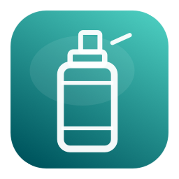
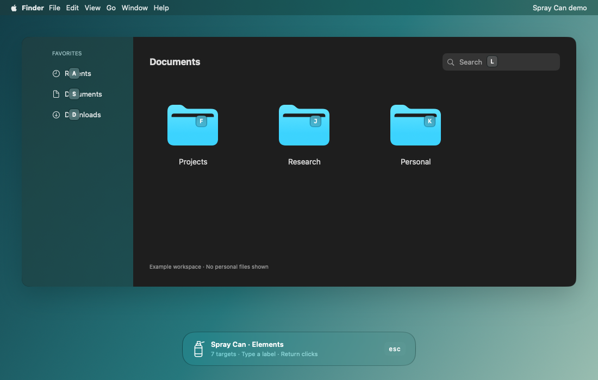
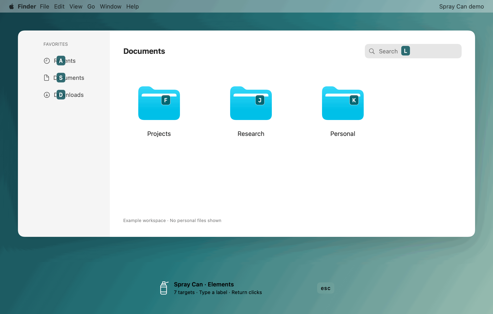
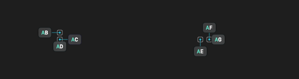
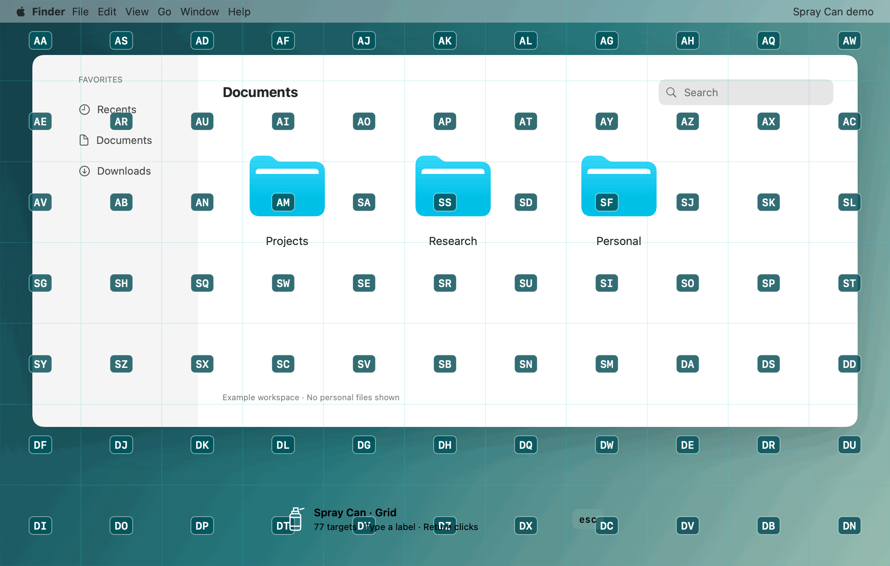
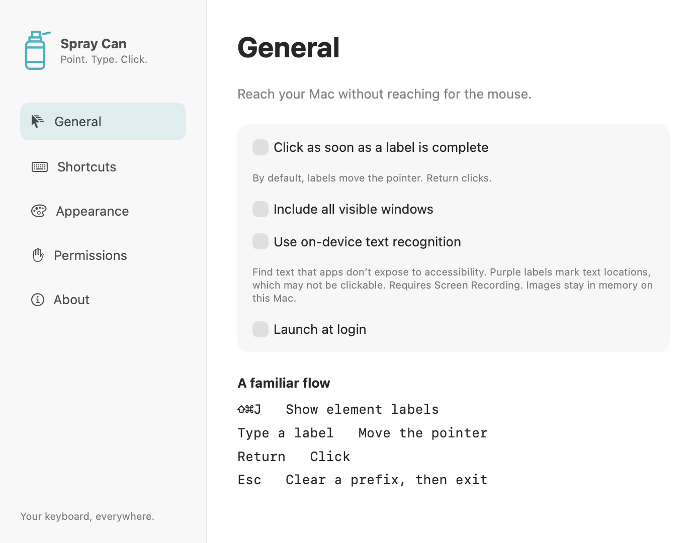
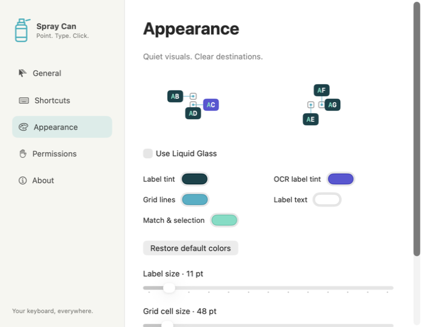

<p align="center">
  
</p>

<h1 align="center">Spray Can</h1>

<p align="center">
  <strong>Keyboard navigation that sees what Accessibility misses.</strong><br>
  Navigate your Mac with labels, grids, and private on-device OCR.
</p>

<p align="center">
  macOS 14+ · Apple Silicon & Intel · Swift + AppKit · 100% local processing
</p>

<p align="center">
  <a href="https://buymeacoffee.com/ziyang">
    <br>
    Support Spray Can
  </a>
</p>

**Free and open source under the [MIT License](LICENSE).**
No subscriptions, paid tiers, analytics, or cloud OCR.



Spray Can lets you **click, drag, scroll, and navigate without reaching for the mouse**.

Press **⇧⌘J**, type a label, and press **Return**.

Unlike tools that rely only on macOS Accessibility, Spray Can can also use **Apple Vision OCR entirely on-device** to label visible text that an app does not expose through its accessibility tree.

Screenshots never leave your Mac.

## See more. Reach everything.

Spray Can combines three targeting layers:

- **Accessibility** — precise controls, buttons, fields, rows, menus, and system UI.
- **On-device OCR** — recognizes visible text when Accessibility does not expose it.
- **Grid** — reaches everything else, including custom canvases and unlabeled areas.

OCR uses **ScreenCaptureKit + Apple Vision** and runs locally. Captured frames are processed in memory and discarded — no cloud inference, screenshot logs, or analytics.



## Four ways to navigate

| Mode | Shortcut | Use it for |
| --- | --- | --- |
| **Elements** | ⇧⌘J | Accessible controls + OCR text |
| **Grid** | ⇧⌘K | Any position on any connected display |
| **Freestyle** | ⇧⌘L | Precise keyboard pointer movement |
| **Scroll** | ⌃J | Vim-style HJKL scrolling |

Global shortcuts are fully configurable.

## Designed to stay out of your way

Spray Can keeps the target app focused while you navigate.

Keyboard input is captured independently of the overlay, so typing can begin immediately while element discovery and OCR continue in the background. Late OCR results cannot change labels after you start typing.

Before clicking, accessible targets are revalidated to reduce stale-target errors.

## Clear labels, even in dense interfaces

Crowded labels automatically shift around nearby controls instead of simply overlapping them. Connector lines show exactly which target each displaced label belongs to.



## Drag, click, scroll

Spray Can supports:

- left, middle, right, and double click
- modifier-click
- drag and drop
- fine and full-cell pointer movement
- screen-edge jumps
- Vim-style scrolling
- multiple displays

Example drag:

`⇧⌘K` → type source label → `=` → type destination label → `Return`



## Native macOS experience



Spray Can is built with Swift and AppKit.

It uses **Liquid Glass on macOS 26+**, native materials on macOS 14–15, and respects Reduce Transparency. Turn off **Use Liquid Glass** in Appearance for plain label and status-panel backgrounds. With glass off, label background opacity is adjustable without fading the text. The slider is disabled while glass or Reduce Transparency is enabled.

You can customize:

- navigation shortcuts
- target scope
- OCR
- vi bindings
- label size
- grid spacing
- background opacity
- label, OCR, grid, text, and selection colors



## Install

Install from [my Homebrew tap](https://github.com/Kymer0615/homebrew-tap):

```sh
brew install --cask kymer0615/tap/spray-can
open "/Applications/Spray Can.app"
```

To update or remove:

```sh
brew update
brew upgrade --cask kymer0615/tap/spray-can
brew uninstall --cask spray-can
```

Ordinary uninstall preserves preferences. If you installed manually, quit Spray Can and move that copy out of Applications before switching to Homebrew to avoid running two copies.

Alternatively, download the universal ZIP from [Releases](https://github.com/Kymer0615/spray_can/releases), extract it, and move **Spray Can.app** into Applications.

Release 0.1.1 is **ad-hoc signed and not notarized**. If macOS blocks a build you trust:

**System Settings → Privacy & Security → Open Anyway**

Spray Can may request:

1. **Accessibility** — discover controls, capture navigation keys, and perform pointer actions.
2. **Screen Recording** — optional, used only for on-device OCR.

Keyboard capture uses Accessibility access; it does not require a separate Input Monitoring setup. The Permissions page reports whether capture is actually running.

Release archives and their SHA-256 checksums are versioned. See [release instructions](docs/RELEASING.md).

## Privacy

Spray Can is designed to work locally.

- OCR runs through **Apple Vision on-device**
- screenshots are processed in memory and discarded
- no screenshot logs
- no analytics
- no cloud inference
- no account or subscription required

## OCR limitations

OCR recognizes **text location**, not whether that text is clickable.

A recognized label may therefore point to a heading or other noninteractive text. It also does not detect every unlabeled icon or arbitrary visual control.

For those cases, use **Grid mode**.

See [VALIDATION.md](docs/VALIDATION.md) for current compatibility and testing status.

## Build

Requires **Xcode 26+**.

```sh
scripts/test.sh
scripts/build.sh
scripts/install-local.sh
```

For development:

```sh
swift scripts/generate-artwork.swift
python3 scripts/generate-project.py
scripts/render-docs.sh
scripts/integration-test.sh
swift scripts/ocr-smoke.swift
scripts/release.sh 0.1.1 adhoc
```

Open `SprayCan.xcodeproj` in Xcode.

`SprayCanCore` contains the session state machine, label generation, geometry, and shortcut mappings. `Sources/SprayCanApp` contains the app UI, event capture, discovery providers, mouse driver, and overlays.

## Status

Spray Can 0.1.1 is available for macOS 14 and later.

The navigation core has been stress-tested with **1,000 rapid activation cycles**, and a native fixture completed **60 element/grid click cycles** without missed clicks or leaked input.

Third-party app, multi-display, fullscreen, and cross-version compatibility are still being validated.

See [VALIDATION.md](docs/VALIDATION.md).

## Community

[Issues and feature ideas](https://github.com/Kymer0615/spray_can/issues), testing, and [contributions](https://github.com/Kymer0615/spray_can/pulls) are welcome.

Useful areas include:

* Accessibility coverage
* OCR validation
* UI and interaction design
* documentation
* cross-app testing

If Spray Can helps you, you can [buy me a coffee](https://buymeacoffee.com/ziyang). Support is optional and never unlocks features.

## Credits

Original implementation and artwork are released under the [MIT License](LICENSE).

Workflow inspiration:
[Scoot](https://github.com/mjrusso/scoot) ·
[Vimac](https://github.com/nchudleigh/vimac)

No source code or visual assets from either project are bundled.

See [architecture and research notes](docs/ARCHITECTURE.md).
