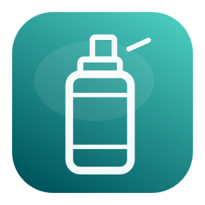
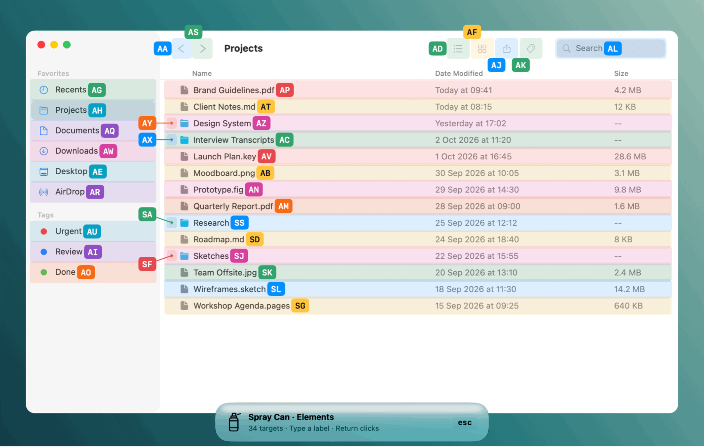
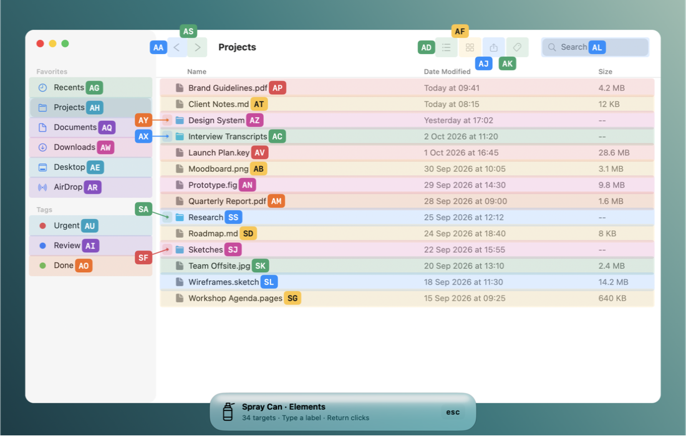
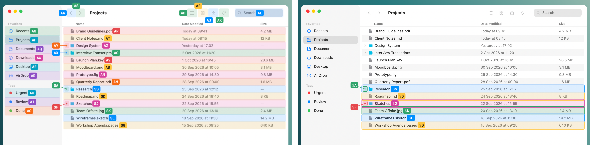
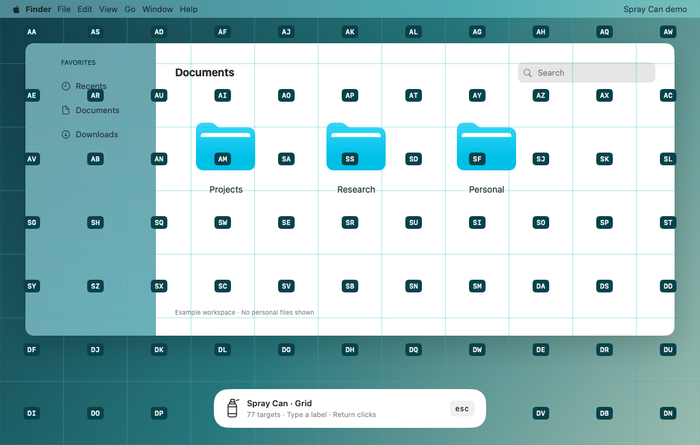
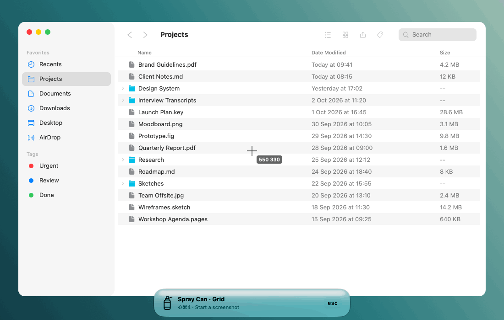
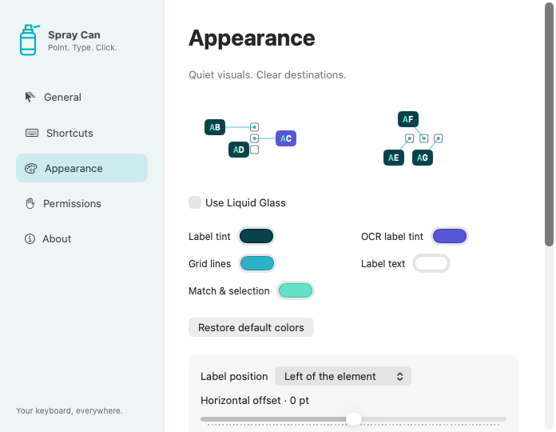

<p align="center">
  
</p>

<h1 align="center">Spray Can</h1>

<p align="center">
  <strong>不碰鼠标，也能点按 Mac 上的任何东西。</strong><br>
  每个控件都有标签，其余位置交给网格，二者之间的文字则由私密的设备端 OCR 识别。
</p>

<p align="center">
  macOS 14+ · Apple 芯片与 Intel · 免费开源（MIT）· 100% 本地处理
</p>

<p align="center">
  🌐 <a href="README.md">English</a> · <strong>简体中文</strong> · <a href="README.zh-Hant.md">繁體中文</a> · <a href="README.ja.md">日本語</a> · <a href="README.ko.md">한국어</a> · <a href="README.es.md">Español</a>
</p>

```sh
brew install --cask kymer0615/tap/spray-can
```



## 使用方法

1. 按下 **⇧⌘J**。每个按钮、链接、列表行和输入框的文字旁边都会出现一个简短的标签。
2. 输入标签，指针随即跳到那里。
3. 按 **Return** 点按；按**两次**即可连按两次，**按住**则进行右键点按。

无需鼠标，无需触控板，也不必四处寻找光标。

## 亮点

<table>
<tr>
<td width="50%" valign="top">

### 标签不碍事
每个标签都位于元素文字的旁边，绝不会遮住你将要点按的文字或图标。即使在密集的列表和工具栏中，每个项目也只有一个标签。



</td>
<td width="50%" valign="top">

### 颜色区分
相邻的标签使用明显不同的颜色，元素也会以对应的颜色着色，让每个标签与其元素一眼就能对上。输入一个字母后，只会保留匹配的项目。提供五种配色方案，其中包括色盲友好方案。



</td>
</tr>
<tr>
<td width="50%" valign="top">

### 其余一切交给网格
画布、游戏、远程桌面、没有标签的图标：按下 **⇧⌘K**，即可触达任意显示器上的任意位置。



</td>
<td width="50%" valign="top">

### 拖移与截屏
按 **Space**（空格键）按住按钮，输入第二个标签拖移到那里，再按一次 **Space** 放下。它甚至可以操作 macOS 截屏工具（⇧⌘4）。



</td>
</tr>
</table>

此外还有：

- **看见辅助功能遗漏之处。** 可选的 Apple Vision OCR 会为未公开控件的应用中的可见文本添加标签，并可同时识别多种语言。
- **平滑滚动模式。** 按 **⌃J**，再用 **HJKL** 或方向键滚动，平滑度可调；按其他键即退出，该键照常发送给应用。在 VS Code 和其他 Electron 应用中同样适用。
- **保留你的快捷键。** 标签显示期间，⌘C、⌘V、⌘W、聚焦搜索以及其他 Spray Can 未占用的快捷键依然有效。
- **随你而动。** 切换标签页、窗口或应用（包括使用 ⌘Tab）时，会显示新的标签。
- **原生体验。** 使用 Swift 和 AppKit 构建，在 macOS 26 上采用 Liquid Glass，界面提供六种语言。

## 四种模式

| 模式 | 快捷键 | 用途 |
| --- | --- | --- |
| **元素** | ⇧⌘J | 按钮、链接、列表行、输入框和 OCR 文本 |
| **网格** | ⇧⌘K | 任意显示器上的任意位置 |
| **自由移动** | ⇧⌘L | 以小步或整格移动指针 |
| **滚动** | ⌃J | HJKL 滚动、半页滚动、跳到顶部和底部 |

所有全局快捷键都可以在设置中更改。

## 速查表

| 按键 | 操作 |
| --- | --- |
| 输入标签 | 将指针移到该处 |
| **Return** | 点按 · 快速按两次：连按两次 · 按住：右键点按 |
| `]` / `[` / `\` | 右键点按 / 中键点按 / 连按两次 |
| **Space** 或 `=` | 按住按钮开始拖移；再按一次放下 |
| 箭头键 · ⌥ 箭头键 | 少量移动指针 · 移动一整格 |
| ⇧ 箭头键 | 滚动 |
| **Esc** | 清除已输入的字母，然后退出 |

完整列表（包括 Emacs 和 vi 按键绑定）请参阅 [SHORTCUTS.md](docs/SHORTCUTS.md)。

## 随心定制



- 标签位置、大小、偏移，以及 Liquid Glass 或纯色背景
- 颜色区分（五种配色方案）、元素着色及着色不透明度
- 滚动平滑度，以及滚动模式下指针停留的位置
- 输入完整标签后立即点按，以及按两次 Return 进行连按
- 开启或关闭 OCR，并设置其识别语言
- 所有全局快捷键，以及可选的 vi 按键绑定

## 安装

```sh
brew install --cask kymer0615/tap/spray-can
open "/Applications/Spray Can.app"
```

使用 `brew update && brew upgrade --cask kymer0615/tap/spray-can` 更新；使用 `brew uninstall --cask spray-can` 卸载（偏好设置会保留）。你也可以从 [Releases](https://github.com/Kymer0615/spray_can/releases) 下载通用 ZIP 包，并将 **Spray Can.app** 移到“应用程序”文件夹。

Spray Can 会请求以下权限：

1. **辅助功能**：用于查找控件、捕获导航按键，以及移动、点按、拖移和滚动。
2. **屏幕录制**（可选）：仅用于设备端 OCR，以及查找标签旁的文字。

各版本均**使用项目自有证书签名，未经公证**。所有版本都使用同一证书签名，因此更新后 macOS 会保留 Spray Can 的权限（自 0.1.7 起）。如果 macOS 阻止了首次打开，请前往**系统设置 → 隐私与安全性 → 仍要打开**。发布的压缩包及其 SHA-256 校验和均带有版本号；请参阅[发布说明](docs/RELEASING.md)。

## 隐私

一切都在你的 Mac 上运行。OCR 使用设备端 Apple Vision；截屏在内存中处理后即被丢弃。无截屏日志、无数据分析、无云端推理，也无需帐户。

## OCR

OCR 可以**同时识别多种语言**。在**通用 → 文本识别语言**中选择语言并排好顺序。使用相同书写系统的语言（英语、法语、西班牙语……）会一起识别；每增加一种书写系统（中文、日文、韩文……），就会在同一张截屏上多进行一轮识别，因此扫描耗时会稍长一些。默认情况下，Spray Can 会选择 Mac 的偏好语言以及英语。

OCR 识别的是文本的位置，而不是它能否点按，因此文本标签可能会指向标题。对于没有标签的图标和自定义画布，请使用网格。有关兼容性和测试状态，请参阅 [VALIDATION.md](docs/VALIDATION.md)。

## 从源代码构建

需要 **Xcode 26+**。

```sh
scripts/test.sh            # core tests + localization check
scripts/build.sh           # universal Release build
scripts/install-local.sh
```

更多工具：`scripts/render-docs.sh`（README 图片）、`scripts/snapshot-labels.sh`（在真实窗口上叠加标签）、`scripts/integration-test.sh`、`swift scripts/ocr-smoke.swift`、`python3 scripts/check-localizations.py`。`SprayCanCore` 包含会话状态机、标签布局及其他纯逻辑；`Sources/SprayCanApp` 包含应用本身、事件捕获、元素查找和叠加层。请参阅 [AGENTS.md](AGENTS.md) 和[架构笔记](docs/ARCHITECTURE.md)。

## 状态

Spray Can 0.1.15 适用于 macOS 14 及更高版本。导航核心已通过 1,000 次快速激活循环的压力测试，原生测试夹具完成了 60 次元素/网格点按循环，没有漏点，也没有输入泄漏。第三方应用、多显示器、全屏以及较早的 macOS 版本仍在验证中；请参阅 [VALIDATION.md](docs/VALIDATION.md)。

## 社区

欢迎提交[问题和功能建议](https://github.com/Kymer0615/spray_can/issues)、参与测试和[贡献代码](https://github.com/Kymer0615/spray_can/pulls)，尤其是辅助功能覆盖范围、OCR 验证、交互设计、文档和跨应用测试方面的帮助。

<p>
  <a href="https://buymeacoffee.com/ziyang"></a>
  如果 Spray Can 对你有帮助，欢迎<a href="https://buymeacoffee.com/ziyang">请我喝杯咖啡</a>。支持完全自愿，也不会解锁任何功能。
</p>

## 致谢

原创实现和美术资源均以 [MIT License](LICENSE) 发布。工作流程灵感来源：[Scoot](https://github.com/mjrusso/scoot) · [Vimac](https://github.com/nchudleigh/vimac)。本项目未包含上述任一项目的源代码或视觉素材。
